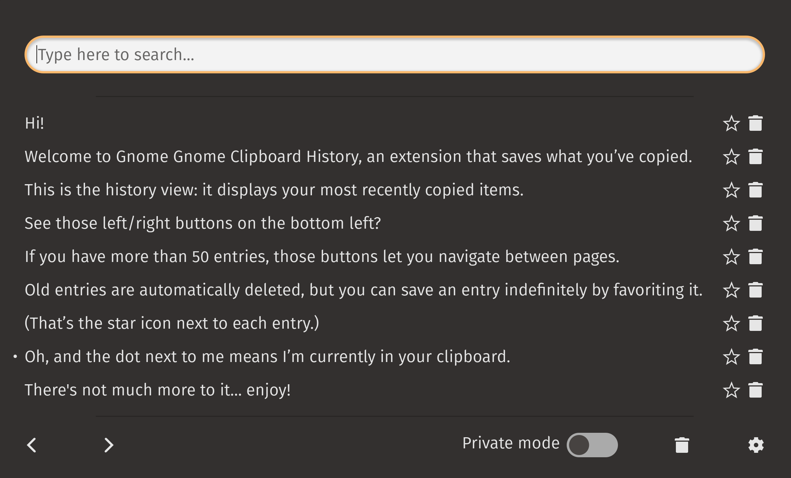

# Gnome Clipboard History

[Gnome Clipboard History](https://extensions.gnome.org/extension/4839/clipboard-history/) is a
clipboard manager GNOME extension that saves what you've copied into an easily accessible,
searchable history panel.

The extension is a rewrite of
[Clipboard Indicator](https://github.com/Tudmotu/gnome-shell-extension-clipboard-indicator) with
vastly improved performance, new features, and
[bug fixes](https://github.com/Tudmotu/gnome-shell-extension-clipboard-indicator/pull/338).

A technical overview is available at https://alexsaveau.dev/blog/gch.

## Download

[](https://extensions.gnome.org/extension/4839/clipboard-history/)

## Tips



- Open the panel from anywhere with <kbd>Super</kbd> + <kbd>Shift</kbd> + <kbd>V</kbd>.
- Modify shortcuts in settings or delete them by hitting backspace while editing a shortcut.
- Use the `Only save favorites to disk` feature to wipe your non-favorited items on shutdown.
- Use `Private mode` to temporarily stop processing copied items.
- Use keyboard shortcuts while the panel is open:
  - <kbd>Ctrl</kbd> + <kbd>N</kbd> where `N` is a number from 1 to 9 to select the Nth
    non-favorited entry.
  - <kbd>Super</kbd> + <kbd>Ctrl</kbd> + <kbd>N</kbd> where `N` is a number from 1 to 9 to select
    the Nth favorited entry.
  - <kbd>Ctrl</kbd> + <kbd>p/n</kbd> to navigate to the previous/next page.
  - <kbd>Ctrl</kbd> + <kbd>Alt</kbd> + <kbd>S</kbd> to open settings.
  - <kbd>/</kbd> to search.
  - <kbd>F</kbd> to (un)favorite a highlighted item.
- Search uses case-insensitive [regex](https://regex101.com/?flavor=javascript).

## Install from source

A note on versioning:

- The `master` branch and `1.4.x` tags support GNOME 45.
- The `pre-45` branch and `1.3.x` (or earlier) tags support GNOME 40-44.

### Build

```shell
cd ~/.local/share/gnome-shell/extensions/ && \
  git clone https://github.com/SUPERCILEX/gnome-clipboard-history.git clipboard-history@alexsaveau.dev && \
  cd clipboard-history@alexsaveau.dev && \
  make
```

### Restart GNOME

<kbd>Alt</kbd> + <kbd>F2</kbd> then type `r`.

### Install

```shell
gnome-extensions enable clipboard-history@alexsaveau.dev
```
